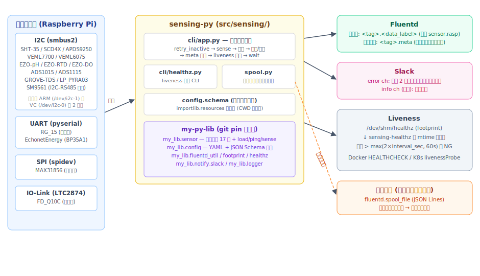
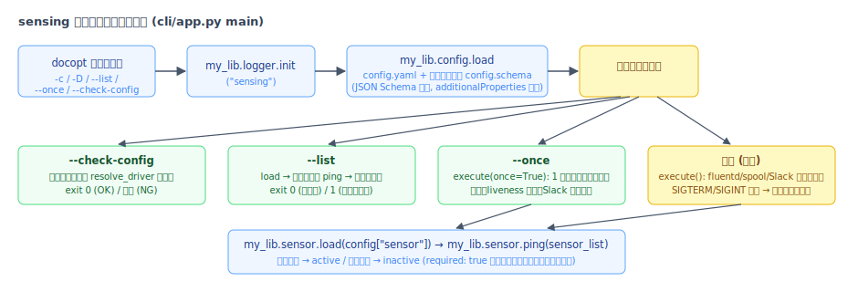
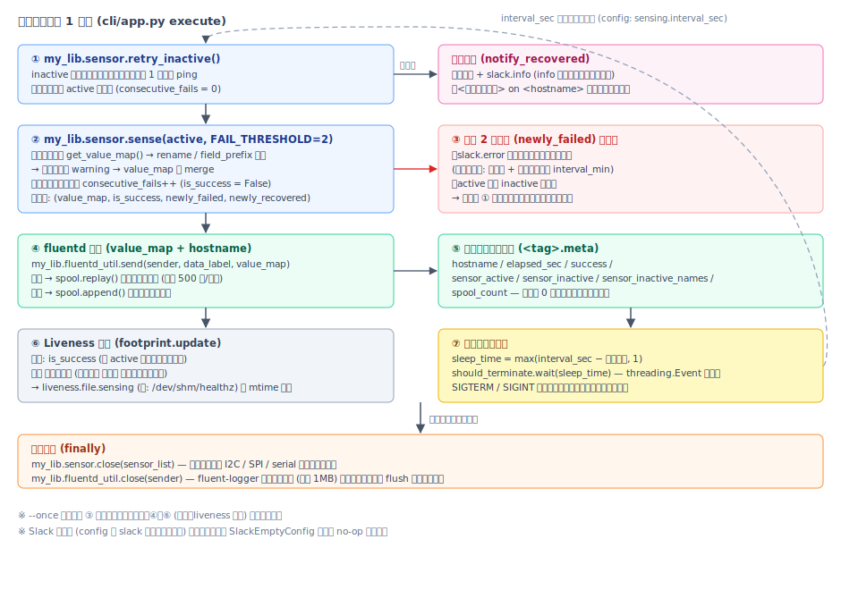
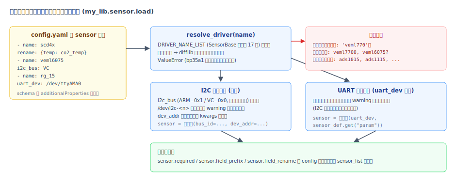
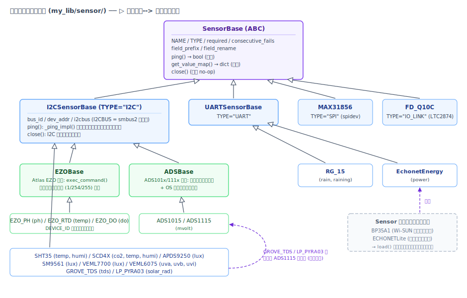
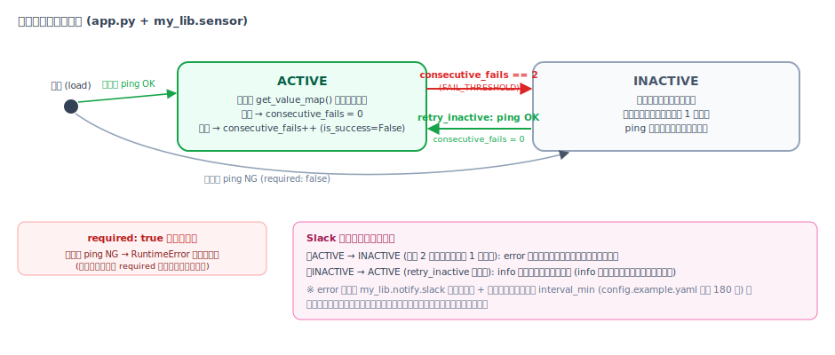
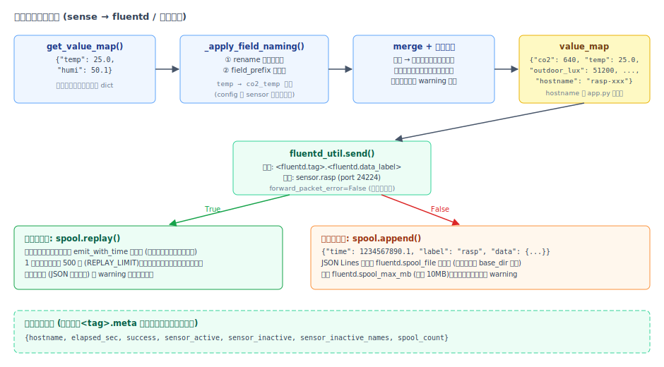
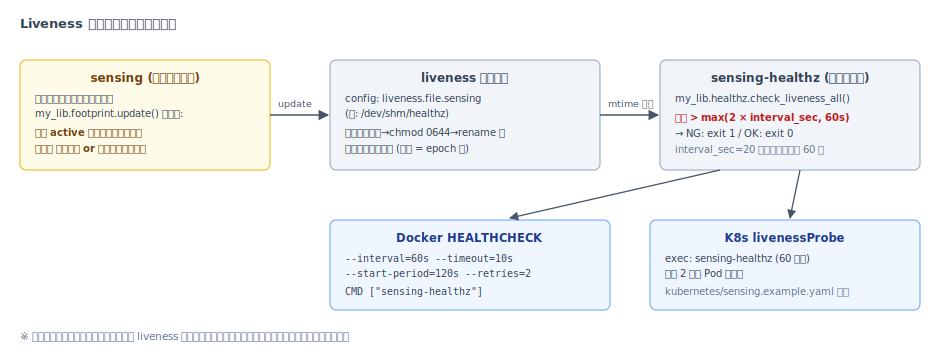

# sensing-py アーキテクチャ

I2C/SPI/UART で接続されたセンサーを周期的に計測し、結果を Fluentd へ送信する常駐アプリケーション
sensing-py の内部構造を説明します。本ドキュメントの記述はすべて実際のコード
(sensing-py と依存ライブラリ [my-py-lib](https://github.com/kimata/my-py-lib)) に基づいています。

## 目次

- [1. 全体像](#1-全体像)
- [2. リポジトリ構成と責務分担](#2-リポジトリ構成と責務分担)
- [3. 起動フローと CLI](#3-起動フローと-cli)
- [4. メインループ](#4-メインループ)
- [5. 設定システム](#5-設定システム)
- [6. センサー抽象化](#6-センサー抽象化)
- [7. センサーの状態遷移と障害処理](#7-センサーの状態遷移と障害処理)
- [8. データフローとスプール](#8-データフローとスプール)
- [9. 可用性: Liveness とヘルスチェック](#9-可用性-liveness-とヘルスチェック)
- [10. テスト戦略](#10-テスト戦略)

## 1. 全体像



sensing-py 本体は薄いアプリケーション層 (Python 約 430 行) で、次の 3 つだけを担います。

1. **メインループの制御** (`src/sensing/cli/app.py`) — 計測周期・通知・送信・liveness 更新の判断
2. **送信失敗時のディスクスプール** (`src/sensing/spool.py`)
3. **liveness 判定 CLI** (`src/sensing/cli/healthz.py`)

センサードライバ・設定ロード・Fluentd/Slack クライアント・footprint (liveness ファイル) といった
再利用可能なロジックはすべて my-py-lib 側 (`my_lib.*`) にあり、sensing-py は
`pyproject.toml` で **git コミットハッシュ固定 (pin)** で依存します。
my-py-lib 側を修正した場合は、pin を更新して `uv lock && uv sync` する運用です。

## 2. リポジトリ構成と責務分担

```
sensing-py/
├── src/sensing/
│   ├── __init__.py          # get_schema_path() — パッケージ内 schema の解決
│   ├── config.schema        # JSON Schema (パッケージに同梱され CWD 非依存で参照される)
│   ├── spool.py             # Fluentd 送信失敗時の退避・再送 (JSON Lines)
│   └── cli/
│       ├── app.py           # エントリポイント `sensing` (メインループ)
│       └── healthz.py       # エントリポイント `sensing-healthz`
├── tests/                   # ハードウェア不要のユニットテスト (フェイクバス使用)
├── config.example.yaml      # 設定例
├── kubernetes/sensing.example.yaml
├── Dockerfile               # マルチステージビルド + HEALTHCHECK
└── .github/workflows/test.yaml
```

sensing-py が利用している my-py-lib のモジュール:

| モジュール | 役割 |
| --- | --- |
| `my_lib.sensor` | ドライバ 17 種と `load()` / `ping()` / `retry_inactive()` / `sense()` / `close()` |
| `my_lib.config` | YAML ロード + JSON Schema 検証 (`base_dir` の注入も行う) |
| `my_lib.fluentd_util` | fluent-logger の薄いラッパ (`get_handle` / `send` / `send_with_time` / `close`) |
| `my_lib.footprint` | liveness ファイルのアトミック更新 (一時ファイル → chmod 0644 → rename) |
| `my_lib.healthz` | liveness ファイルの経過時間判定 |
| `my_lib.notify.slack` | 故障・復帰通知 (レート制限付き) |
| `my_lib.logger` | ロガー初期化 |

## 3. 起動フローと CLI



`sensing` コマンドは docopt でオプションを解釈し、4 つの動作モードを持ちます。

| モード | 動作 | 終了コード |
| --- | --- | --- |
| (指定なし) | 常駐してメインループを実行 | - |
| `--check-config` | 設定をスキーマ検証し、全センサー名を `my_lib.sensor.resolve_driver()` で検証 | 0 / 例外 |
| `--list` | 全センサーを構築して ping し、結果を表形式で表示 | 0 (全応答) / 1 |
| `--once` | 1 周期だけ計測して結果を表示。Fluentd 送信・liveness 更新・Slack 通知は行わない | 0 |

`config.schema` は `importlib.resources` でパッケージ内から解決されるため
(`sensing.get_schema_path()`)、**カレントディレクトリに依存せず** systemd や cron からも
そのまま起動できます。ホスト名は環境変数 `NODE_HOSTNAME` があればそれを、なければ
`socket.gethostname()` を使います。

## 4. メインループ



`execute()` は `sensing.interval_sec` ごとに次の処理を繰り返します。

1. **復帰確認** — `retry_inactive()` が inactive センサーを**ラウンドロビンで毎周期 1 台だけ** ping し、
   応答があれば active に戻す (1 周期の所要時間を伸ばさないための設計)。
2. **計測** — `sense(active, FAIL_THRESHOLD=2)`。センサーごとの例外は捕捉され、そのセンサーの
   `consecutive_fails` を増やすだけで他のセンサーの計測は続行される。
3. **故障処理** — 連続失敗がちょうど 2 回に達したセンサー (`newly_failed`) は Slack error 通知の上、
   **inactive に降格**される。故障センサー 1 台が liveness を止め続けることを防ぐ。
4. **送信** — value_map を Fluentd へ送信。失敗時はスプールへ退避、成功時はスプールの滞留分を再送。
5. **メタ送信** — 周期の成否・所要時間などを `<tag>.meta` へ送信 (下流で欠測を判別するため)。
6. **liveness 更新** — 「全 active センサーの計測成功」かつ「データ保全 (送信成功またはスプール退避成功)」
   のときのみ footprint を更新。
7. **待機** — `threading.Event.wait()` で待機。SIGTERM / SIGINT を受けると即座に解除されて
   ループを抜け、finally でセンサーのハンドル解放と fluentd sender の flush + close を行う
   (`time.sleep()` を使わないのは、PEP 475 によりシグナル受信後も sleep が再開されてしまうため)。

## 5. 設定システム

設定は「**JSON Schema による構文検証** (my_lib.config) + **ドライバ名のホワイトリスト検証**
(my_lib.sensor)」の 2 段階で検証されます。schema は各セクションで
`additionalProperties: false` を指定しており、タイポや読まれないキーは起動時に検出されます。



主な設定キー (全体は [config.example.yaml](../config.example.yaml) と
[config.schema](../src/sensing/config.schema) を参照):

| キー | 既定値 | 説明 |
| --- | --- | --- |
| `fluentd.host` | (必須) | 送信先ホスト |
| `fluentd.port` | 24224 | 送信先ポート |
| `fluentd.tag` | `sensor` | fluent-logger のタグ。実際の送信タグは `<tag>.<label>` |
| `fluentd.data_label` | `rasp` | 計測値レコードのラベル (メタは固定で `meta`) |
| `fluentd.spool_file` | なし (無効) | 送信失敗レコードの退避先。相対パスは config のあるディレクトリ基準 |
| `fluentd.spool_max_mb` | 10 | スプールの上限サイズ |
| `sensor[].name` | (必須) | ドライバ名 (下表の 17 種) |
| `sensor[].i2c_bus` | `ARM` | `ARM` (/dev/i2c-1) / `VC` (/dev/i2c-0)。大文字小文字不問 |
| `sensor[].dev_addr` | ドライバ既定 | I2C アドレス |
| `sensor[].uart_dev` | - | 指定すると UART センサーとして構築 |
| `sensor[].param` | - | UART センサー固有パラメータ (EchonetEnergy の `if`/`id`/`pass` など) |
| `sensor[].required` | false | true なら起動時に応答がない場合 RuntimeError で起動失敗 |
| `sensor[].field_prefix` | `""` | 計測値キーに付ける接頭辞 (同種センサー併用時の衝突回避) |
| `sensor[].rename` | `{}` | 計測値キーの置換マップ (例: `temp: co2_temp`) |
| `sensing.interval_sec` | (必須) | 計測周期。sleep は `max(interval - 経過時間, 1)` 秒 |
| `liveness.file.sensing` | (必須) | liveness ファイルのパス |
| `slack` | なし (無効) | `error` (故障通知、必須要素) と `info` (復帰通知、任意) |

## 6. センサー抽象化



すべてのドライバは `my_lib.sensor.base.SensorBase` (ABC) を継承し、次の契約に従います。

- **`ping() -> bool` は例外を投げない** — `I2CSensorBase.ping()` は `_ping_impl()` の全例外を
  「応答なし (False)」として扱う。さらに呼び出し側 (`my_lib.sensor.ping()` /
  `retry_inactive()`) にも `_safe_ping()` による二重防御がある。
- **`get_value_map() -> dict`** — 計測失敗は例外で表現する。`sense()` が捕捉して連続失敗を数える。
- **`close()`** — I2C / SPI / serial のハンドルを解放する (既定は no-op)。

`load()` が受け付けるのは `DRIVER_NAME_LIST` に載った **SensorBase 準拠の 17 ドライバのみ**です。
BP35A1 (Wi-SUN セッション層) や ECHONETLite (プロトコル実装) のような補助クラスは
ホワイトリストから除外され、config に書くと候補提示付きの `ValueError` になります。

| config name | クラス | 接続 | 計測値キー | 既定アドレス等 |
| --- | --- | --- | --- | --- |
| `sht35` | SHT35 | I2C | `temp`, `humi` | 0x44 |
| `scd4x` | SCD4X | I2C | `co2`, `temp`, `humi` | 0x62 |
| `apds9250` | APDS9250 | I2C | `lux` | 0x52 |
| `veml7700` | VEML7700 | I2C | `lux` | 0x10 |
| `veml6075` | VEML6075 | I2C | `uva`, `uvb`, `uvi` | 0x10 (VEML7700 と同一のため同一バス併用不可) |
| `sm9561` | SM9561 | I2C (RS-485 変換) | `lux` | 0x4D |
| `ezo_ph` | EZO_PH | I2C | `ph` | 0x64 |
| `ezo_rtd` | EZO_RTD | I2C | `temp` | 0x66 |
| `ezo_do` | EZO_DO | I2C | `do` | 0x68 (運用機材に合わせた値。工場出荷値は 0x61) |
| `ads1015` | ADS1015 | I2C | `mvolt` | 0x4A |
| `ads1115` | ADS1115 | I2C | `mvolt` | 0x48 |
| `grove_tds` | GROVE_TDS | I2C (内部 ADS1115) | `tds` | 0x48 |
| `lp_pyra03` | LP_PYRA03 | I2C (内部 ADS1115) | `solar_rad` | 0x48 |
| `max31856` | MAX31856 | SPI | `temp` | bus 0 / dev 0 |
| `fd_q10c` | FD_Q10C | IO-Link (LTC2874) | `flow` | /dev/ttyAMA0 |
| `rg_15` | RG_15 | UART | `rain`, `raining` | /dev/ttyAMA0 |
| `echonetenergy` | EchonetEnergy | UART (Wi-SUN) | `power` | `param.if`/`id`/`pass` が必要 |

実装上の共通基盤:

- **`I2CBUS`** (`my_lib/sensor/i2cbus.py`) — smbus2 のラッパ。全 I/O をデバッグログに出す。
  `ARM = 0x1`, `VC = 0x0` の 2 バスを定数として持つ。
- **`EZOBase`** — Atlas Scientific EZO シリーズ共通のコマンド実行。応答先頭のステータスバイト
  (1=成功, 254=処理中, 255=データなし) を検査し、異常時は `SensorCommunicationError` を送出。
- **`ADSBase`** — ADS1015/1115 共通。シングルショット変換を開始し、config レジスタの
  OS ビットをポーリングして変換完了後に読む。
- 通信系の待ちループ (SM9561 の FIFO 待ち、EchonetEnergy の受信リトライ、LTC2874 の
  WAIT 応答など) にはすべて上限があり、超過時は `SensorCommunicationError` を送出して
  「そのセンサーだけの失敗」に閉じ込める。

## 7. センサーの状態遷移と障害処理



センサーは app.py が管理する 2 つのリスト (`active_sensor_list` / `inactive_sensor_list`)
のどちらかに属します。ポイントは次の 3 つです。

- **障害の単位はセンサー 1 台** — 計測例外は `sense()` 内で捕捉され、他のセンサーへ波及しない。
- **通知は状態遷移の瞬間に 1 回だけ** — 故障通知は `consecutive_fails` がちょうど閾値 (2) に達した
  周期のみ。加えて `my_lib.notify.slack` 側でアプリ名 + タイトル別の時間ベースのレート制限
  (`slack.error.interval_min`) がかかる。
- **自動復帰** — inactive のセンサーは毎周期 1 台ずつ ping され、応答すれば active に戻る。
  復帰時は info チャンネル設定時のみ Slack 通知される (ログには常に出力)。

なお `sense()` 自体はセンサーを降格させず、`newly_failed` / `newly_recovered` を返すだけです。
降格の判断は呼び出し側 (app.py) の責務としており、ライブラリの他の利用者は別のポリシーを
選択できます。

## 8. データフローとスプール



- **キーの命名制御** — 各センサーの `get_value_map()` の結果に対し、`sense()` が
  config の `rename` → `field_prefix` の順で適用します。適用後にキーが他センサーと重複した場合は
  「どのセンサーの値で上書きされるか」を warning ログに出します (上書き自体は行われる)。
- **スプール** (`sensing/spool.py`) — fluent-logger の内部バッファは最大 1MB でプロセス終了時に
  失われるため、送信失敗レコードを JSON Lines でディスクに退避します。
  送信が復旧した周期に先頭から最大 500 件 (`REPLAY_LIMIT`) を `emit_with_time` で
  **元のタイムスタンプ付き**で再送し、失敗レコードに当たった時点で中断して残りを持ち越します。
  破損行は警告つきで破棄、ファイルサイズは `spool_max_mb` で上限が設けられます。
- **メタレコード** — 計測値とは独立に、毎周期 `<tag>.meta` へ周期の成否・所要時間・
  inactive センサー名・スプール滞留数を送信します。スプールの対象外です。
- **偽陽性の防止** — `get_handle()` は `forward_packet_error=False` を指定しており、
  msgpack 化できないデータを送った場合に「成功扱い」になることを防ぎます。

## 9. 可用性: Liveness とヘルスチェック



- **liveness ファイル** — `my_lib.footprint.update()` が一時ファイル作成 → `chmod 0644` →
  `rename` の手順でアトミックに更新します (0644 にするのは healthz を別ユーザーで実行する
  構成でも読めるようにするため)。
- **判定** — `sensing-healthz` は `my_lib.healthz.check_liveness_all()` を呼び、最終更新からの
  経過時間が `max(2 × interval_sec, 60 秒)` を超えていれば異常 (exit 1) とします。
- **監視主体** — Dockerfile の `HEALTHCHECK` と K8s の `livenessProbe`
  ([kubernetes/sensing.example.yaml](../kubernetes/sensing.example.yaml)) の両方から
  同じ CLI を使います。
- **graceful shutdown** — SIGTERM / SIGINT は `threading.Event` を set するだけで、
  終了処理 (センサーのハンドル解放、fluentd バッファの flush) はメインループの finally で
  行われます。

この設計では、プロセスのハングや連続的な計測失敗は「liveness が更新されない」ことを通じて
コンテナ再起動として回復が図られます。一方 **Fluentd 側の障害はスプールで吸収**されるため、
liveness には影響しません (スプールも書けない場合のみ liveness が止まります)。

## 10. テスト戦略

テストはハードウェアなしで実行できます (`uv run pytest tests/unit`)。

- **フェイクバス** — `tests/conftest.py` の `fake_bus` フィクスチャが `smbus2.SMBus` と
  `spidev.SpiDev` をフェイクに差し替え、実デバイスなしでドライバの構築を検証します。
- **フェイクセンサー** — `SensorBase` を継承した `FakeSensor` で、ping 例外・計測失敗・
  復帰などのシナリオを注入します。
- 主なカバレッジ:
    - `test_config.py` — **config.example.yaml と schema と load() の三者整合**
      (存在しないドライバ名や読まれないキーが example に混入する事故の回帰テスト)
    - `test_load.py` — ドライバ解決・バス/デバイス不在時のスキップ・field naming の設定
    - `test_sensor_pipeline.py` — ping 契約、故障閾値、復帰、キー衝突警告、rename/prefix
    - `test_app.py` — メインループ 1 周期の統合 (liveness 条件、スプール退避と再送、降格)
    - `test_spool.py` — スプールの追記・再送・破損行処理・サイズ上限

CI ([.github/workflows/test.yaml](../.github/workflows/test.yaml)) では上記テストに加えて
`sensing --check-config -c config.example.yaml` を実行し、設定例が常に起動可能であることを
保証しています。
